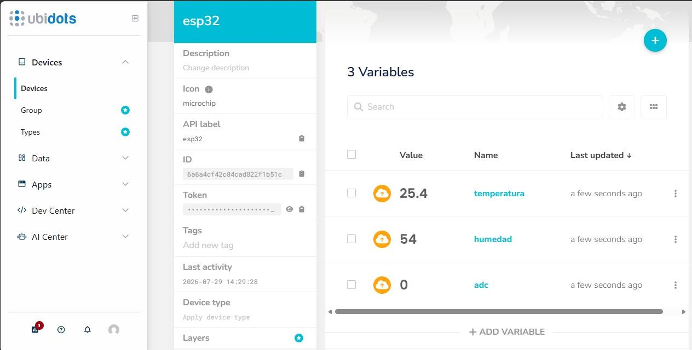
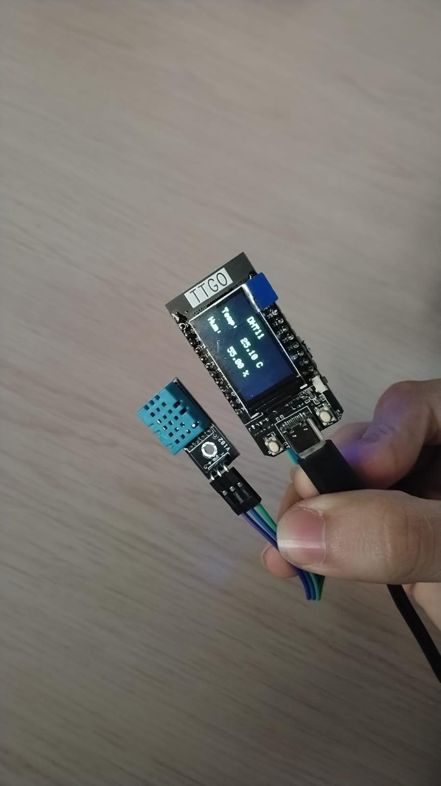
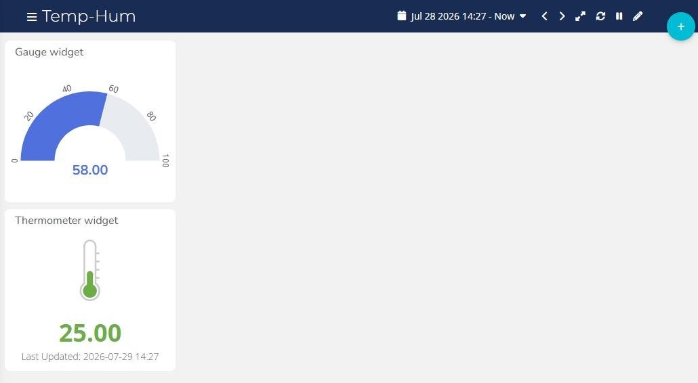

# Práctica 1 — Temperatura y humedad en Ubidots

El ESP32 lee el sensor DHT11 y publica los datos en un dispositivo de Ubidots llamado `esp32`, con tres variables: `temperatura`, `humedad` y `adc`. Los datos se visualizan en un dashboard (`Temp-Hum`) con un termómetro y un medidor tipo gauge.

Informe: [Practica1_SamuelGil.pdf](Practica1_SamuelGil.pdf). El informe de esta práctica contiene solo las evidencias; no incluye código.

## Evidencias

**Variables recibidas en Ubidots**

**Montaje: TTGO T-Display con el DHT11**

**Dashboard**

