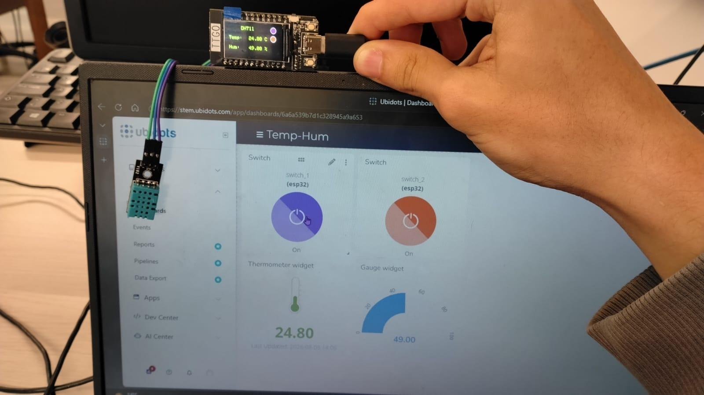
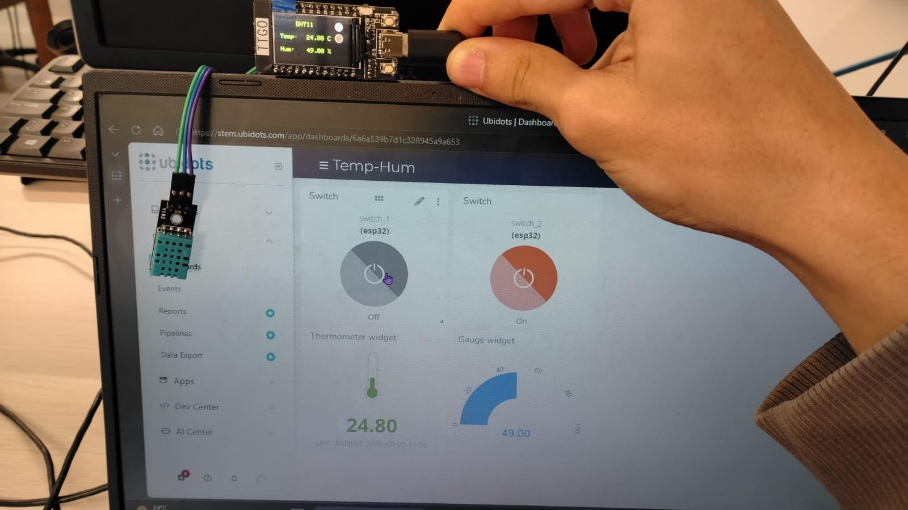
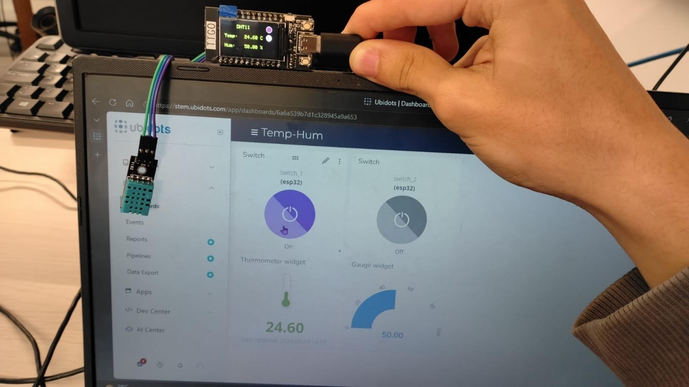
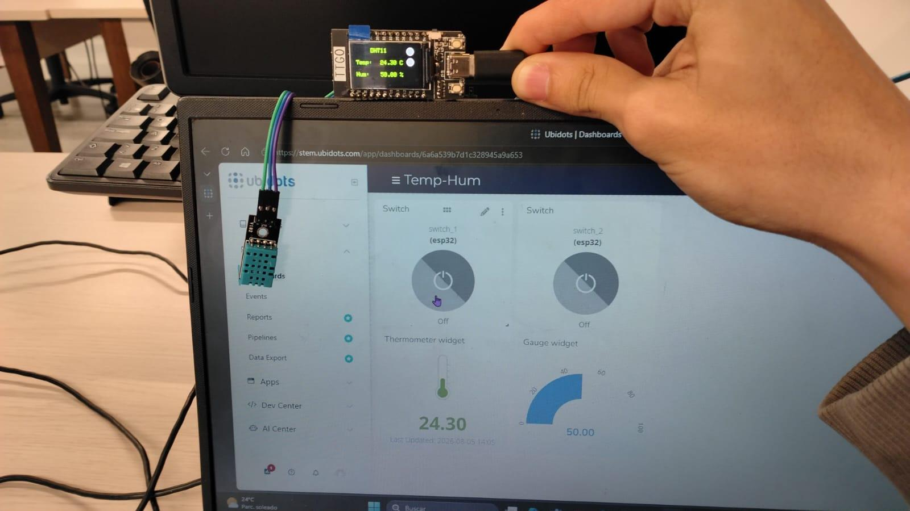

# Práctica 2 — Control desde Ubidots con dos switches

Sobre la base de la Práctica 1, el ESP32 se suscribe por MQTT a dos variables de Ubidots, `switch_1` y `switch_2`. Cada vez que se acciona un switch en el dashboard, el dispositivo recibe el valor y actualiza un indicador circular en su pantalla.

- Informe: [Practica2_SamuelGil.pdf](Practica2_SamuelGil.pdf)
- Código: [Practica2/Practica2.ino](Practica2/Practica2.ino)

## Funcionamiento

- Cada 5 segundos (`PUBLISH_FREQUENCY = 5000`) se leen temperatura y humedad del DHT11 y el valor del ADC, y se publican en el dispositivo `esp32` como `Temperatura`, `Humedad` y `ADC`.
- La pantalla muestra las lecturas del DHT11 en verde.
- `callback()` recibe los mensajes de las variables suscritas: un valor de `1` enciende el indicador y cualquier otro lo apaga.
- `drawSwitchIndicators()` dibuja los dos indicadores a la derecha de la pantalla: morado para `switch_1`, rojo para `switch_2` y gris oscuro cuando están apagados.
- Si se pierde la conexión, en `loop()` se reconecta y se vuelve a suscribir a las dos variables.

## Evidencias

| Ambos encendidos | Solo `switch_2` |
|---|---|
|  |  |

| Solo `switch_1` | Ambos apagados |
|---|---|
|  |  |

## Antes de cargar el programa

Reemplazar `TU_TOKEN_DE_UBIDOTS` por el token propio y ajustar `WIFI_SSID` y `WIFI_PASS`. El token no se sube al repositorio; en el informe aparece tapado por la misma razón.
