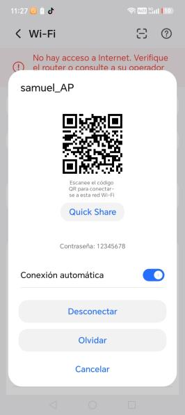
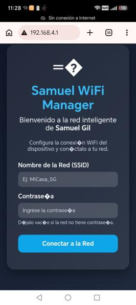
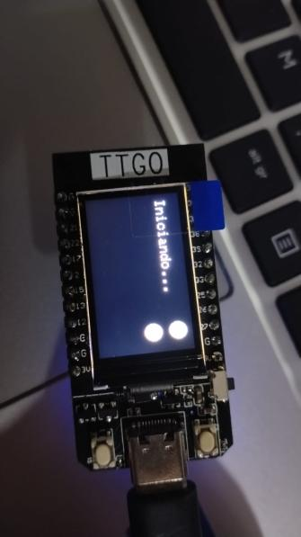
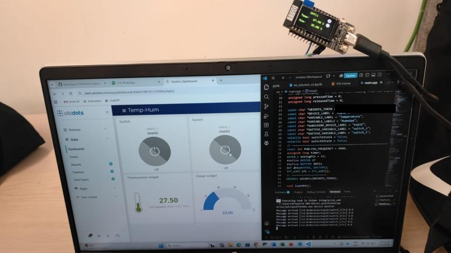
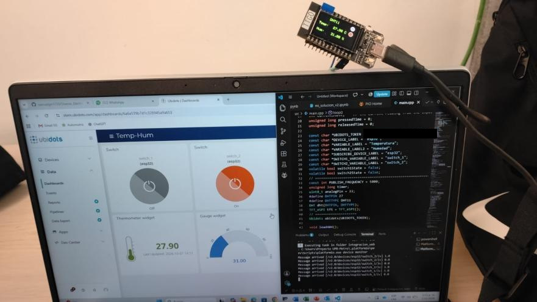
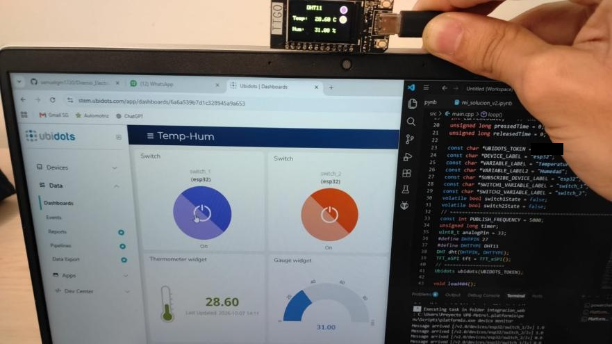
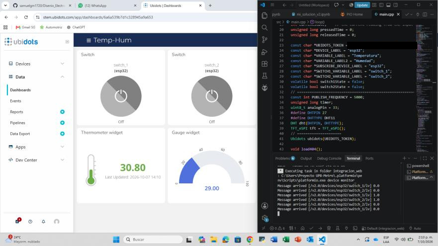
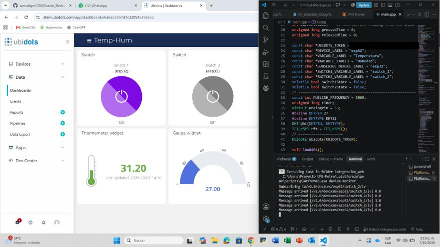
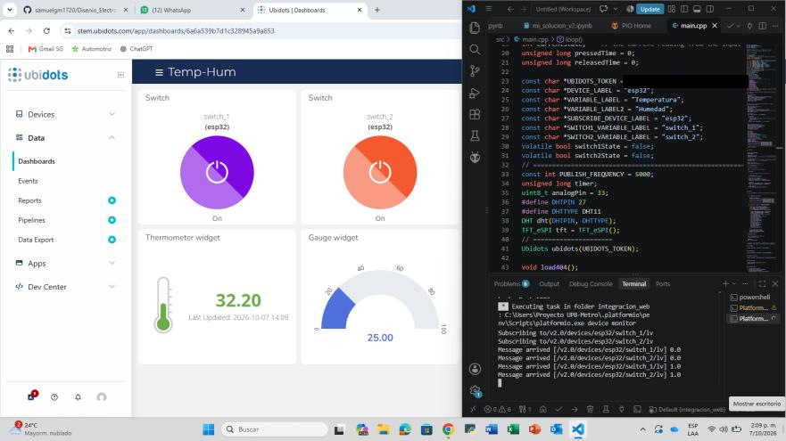

# Práctica 3 — Portal de configuración WiFi (modo AP) e integración con Ubidots

La placa ya no lleva la red WiFi escrita en el código. Si no tiene una red guardada, crea su propio punto de acceso y sirve un portal web donde se escriben el nombre y la contraseña de la red; los guarda en la EEPROM, se reinicia y, ya conectada, publica en Ubidots igual que en la Práctica 2.

- Informe: [Practica3_SamuelGil.pdf](Practica3_SamuelGil.pdf)
- Código: [src/main.cpp](src/main.cpp)

## Funcionamiento

- **Sin red guardada:** la placa crea el punto de acceso `samuel_AP` y atiende el portal de configuración en `192.168.4.1`.
- **Con red guardada:** se conecta en modo estación, publica `Temperatura`, `Humedad` y `ADC` cada 5 segundos y se suscribe a `switch_1` y `switch_2`.
- **Pulsación larga (3 s) del botón del GPIO 0:** borra la marca de la EEPROM y la placa vuelve al modo de configuración.
- Si después de 100 intentos no logra conectarse a la red guardada, también vuelve al modo de configuración.
- La pantalla muestra temperatura y humedad y dos indicadores: morado para `switch_1` y rojo para `switch_2`.

## Evidencias

**Modo AP: celular conectado a `samuel_AP`, portal de configuración y placa al iniciar**

  

**Placa y tablero de Ubidots**

| Ambos apagados | Solo `switch_2` | Ambos encendidos |
|---|---|---|
|  |  |  |

**Tablero y monitor serial**

| Ambos apagados | Solo `switch_1` | Ambos encendidos |
|---|---|---|
|  |  |  |

## Antes de compilar

- Reemplazar `TU_TOKEN_DE_UBIDOTS` por el token propio. El token no se sube al repositorio; en el informe y en las capturas aparece tapado por la misma razón.
- `main.cpp` incluye `data.h` (las páginas del portal) y `Settings.h` (lectura y escritura de la red en la EEPROM). Esos dos archivos no están en el informe, así que no están aquí: sin ellos el proyecto no compila.
- El proyecto se trabajó en PlatformIO, con el código en `src/main.cpp`.
